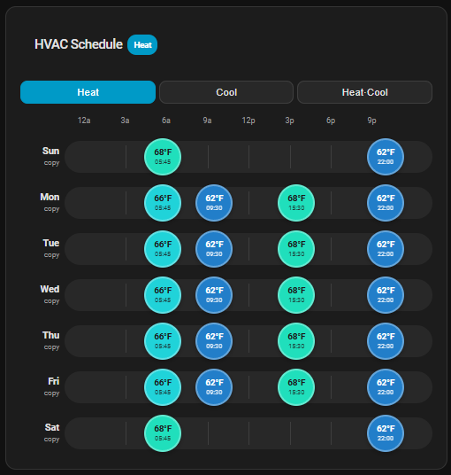

# HVAC Scheduler Card

A Nest-style weekly temperature scheduler Lovelace card for Home Assistant.



Shows the full week (Sunday → Saturday) as a timeline grid with a **temperature circle** per setpoint, exactly like a Nest thermostat's schedule view. Supports copy/paste between days, desktop and mobile layouts, and integrates natively with the [scheduler-component](https://github.com/nielsfaber/scheduler-component).

## Features

- 🗓️ Full week view — Sun → Sat — with a proportional 24-hour timeline per day
- 🌡️ Temperature circles colored cool (blue) → warm (orange), like Nest
- ✏️ Tap a circle to edit; tap an empty lane to add a new setpoint
- 📋 Click any day label to copy it, then paste to multiple other days at once
- 💾 Explicit Save button (changes are not written until you save, to avoid flooding the scheduler)
- 🔃 Reload button to pull the current live schedule at any time
- 📱 Responsive: full timeline on desktop, compact on mobile
- 🤖 Auto-groups identical days into single scheduler entities (Mon–Thu identical = one `switch.schedule_*`)
- Supports single setpoint (heat/cool) and dual setpoint (heat_cool/auto) modes

## Requirements

- Home Assistant ≥ 2023.9
- [scheduler-component](https://github.com/nielsfaber/scheduler-component) installed and configured

## Installation

### HACS (recommended)

1. Open HACS → Frontend → three-dot menu → **Custom repositories**
2. Add `https://github.com/jordanruthe/hvac-scheduler-card` as a **Lovelace** repository
3. Install **HVAC Scheduler Card**
4. Hard-refresh your browser

### Manual

1. Download `hvac-scheduler-card.js` from [Releases](https://github.com/your-repo/hvac-scheduler-card/releases/latest)
2. Copy it to `config/www/hvac-scheduler-card.js`
3. In Home Assistant: Settings → Dashboards → three-dot menu → **Manage resources**
4. Add `/local/hvac-scheduler-card.js` as a **JavaScript module**

## Configuration

```yaml
type: custom:hvac-scheduler-card
entity: climate.main_thermostat   # required
name: Thermostat Schedule         # optional — card title
min_temp: 60                      # optional (default: 60)
max_temp: 90                      # optional (default: 90)
step: 1                           # optional temperature step (default: 1)
temperature_unit: "°F"            # optional — auto-detected from HA
```

### Config options

| Option | Type | Default | Description |
|---|---|---|---|
| `entity` | string | **required** | `climate.*` entity to schedule |
| `name` | string | `HVAC Schedule` | Card title |
| `min_temp` | number | `60` | Minimum temperature for the stepper |
| `max_temp` | number | `90` | Maximum temperature for the stepper |
| `step` | number | `1` | Temperature step size |
| `temperature_unit` | string | auto | Override unit display (`°F` or `°C`) |

## Usage

### Adding a setpoint

Click/tap anywhere on an empty timeline lane to add a temperature setpoint at that time. A dialog opens to set the exact time, temperature, and optionally change the HVAC mode at that point.

### Editing or deleting a setpoint

Tap an existing temperature circle to open the editor. You can change the time, temperature, or delete the setpoint.

### Copy/paste between days

1. Click a **day label** (e.g. "Mon") to copy that day's schedule — the label turns blue.
2. A **paste bar** appears below the grid. Click/tap one or more day chips to select which days should receive the copy.
3. Click **Apply** to paste. The source day's setpoints are deep-copied to each selected day.
4. Click **Save** to persist changes to the scheduler.

### Save / Reload

- Changes are **not written** until you click **Save**. An orange dot in the title indicates unsaved changes.
- Click **Reload** to discard local changes and refresh from the current scheduler state.

## How it integrates with the scheduler

The card manages `switch.schedule_*` entities that target your configured climate entity. It:

- Tags each entity it creates with `hvac-scheduler-card` so it never touches schedules it didn't create
- Groups days with identical setpoints into a single scheduler entity automatically
- Writes setpoints as `climate.set_temperature` actions with `temperature` (single mode) or `target_temp_low`/`target_temp_high` (auto/heat_cool mode)

## Development

```bash
npm install
npm run build     # builds dist/hvac-scheduler-card.js
npm run watch     # watch mode with source maps
npm test          # run unit tests (vitest)
```

## License

MIT
